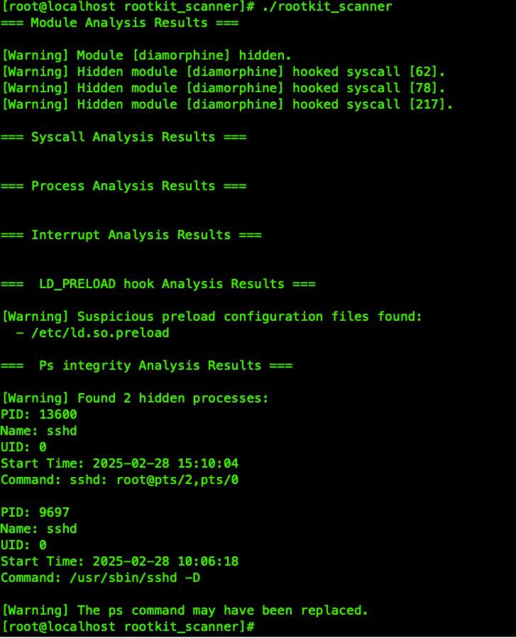

# Rootkit_Scanner

This scanner supports both kernel-mode and user-mode rootkits.


```bash

CentOS
#  yum install -y golang kernel-devel-$(uname -r) kernel-headers-$(uname -r) gcc gcc-c++ make

Debian + Ubuntu
# apt install -y linux-headers-$(uname -r) gcc g++ make golang


# make  &&  insmod rootkit_sc_driver.ko 
# ./rootkit_scanner

```
